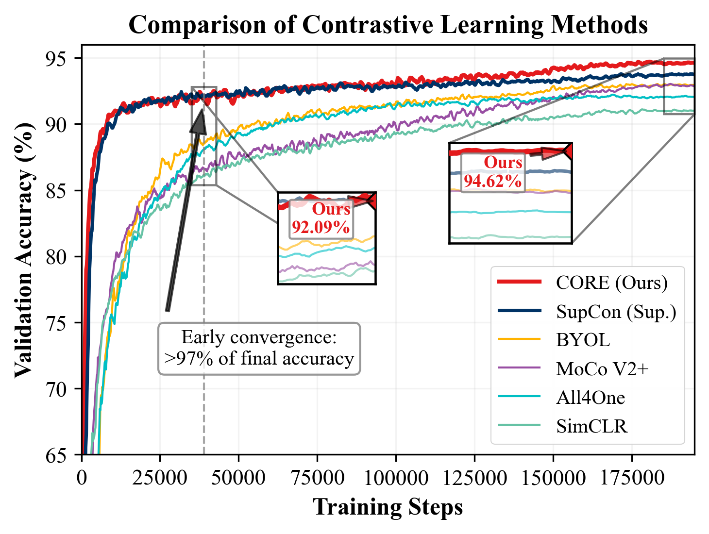

# CORE: COntrastive Representation with Essential Components

Official implementation for **"Less is More: Minimal Components for Contrastive Learning Delivering Superior Accuracy and Efficiency"**, published in *IEEE Transactions on Neural Networks and Learning Systems* (Early Access, Sep. 2026).

**[Paper (IEEE Xplore)](https://doi.org/10.1109/TNNLS.2026.3726311)**

<p align="center">
  
</p>
<em>CORE reaches over 97% of its final performance in the early training stages (Fig. 1 of the paper).</em>

## Overview

CORE is a minimalist self-supervised learning framework that achieves state-of-the-art performance through principled simplification. Key innovations:

- **Cross-View Symmetric InfoNCE Loss**: Purifies contrastive learning by exclusively using inter-view negatives
- **Shared Encoder Architecture**: Eliminates redundant momentum encoders while maintaining stability
- **Information Bottleneck Projection Head**: Optimized 3-layer MLP design

## Results

| Dataset | Backbone | CORE | SimCLR | Improvement |
|---------|----------|------|--------|-------------|
| CIFAR-10 | ResNet-18 | **94.89%** | 90.74% | +4.15% |
| CIFAR-100 | ResNet-18 | **73.80%** | 65.78% | +8.02% |
| ImageNet-100 | ResNet-18 | **82.76%** | 76.92% | +5.84% |
| ImageNet | ResNet-50 | **73.72%** | - | - |

## Installation

```bash
pip install -r requirements.txt
pip install -e .
```

## Quick Start

### Pretraining on CIFAR-10

```bash
python main_pretrain.py \
    --config-path scripts/pretrain/cifar \
    --config-name core.yaml
```

### Pretraining on ImageNet-100

```bash
python main_pretrain.py \
    --config-path scripts/pretrain/imagenet-100 \
    --config-name core.yaml
```

### Linear Evaluation

```bash
python main_linear.py \
    --config-path scripts/linear/imagenet-100 \
    --config-name simclr.yaml \
    pretrained_feature_extractor=PATH_TO_CHECKPOINT
```

### KNN Evaluation

```bash
python main_knn.py \
    --config-path scripts/knn/imagenet-100 \
    pretrained_feature_extractor=PATH_TO_CHECKPOINT
```

## Configuration

Key hyperparameters in `scripts/pretrain/*/core.yaml`:

```yaml
method_kwargs:
  proj_hidden_dim: 2048      # Projection head hidden dimension
  proj_output_dim: 256       # Projection head output dimension
  temperature: 0.1           # InfoNCE temperature

optimizer:
  batch_size: 256            # Batch size (256 for CIFAR, 1024 for ImageNet)
  lr: 0.3                    # Base learning rate
```

## Core Implementation

The essential CORE components are located in:

- `solo/methods/core.py` - CORE method implementation
- `solo/losses/core.py` - Cross-View Symmetric InfoNCE loss

### Cross-View Symmetric Loss

```python
def core_contrastive_loss(z1, z2, temperature=0.1):
    """
    CORE's cross-view contrastive loss.
    Only uses inter-view negatives (no intra-view negatives).
    """
    z1 = F.normalize(z1, dim=-1)
    z2 = F.normalize(z2, dim=-1)
    
    sim = torch.exp(torch.einsum("if, jf -> ij", z1, z2) / temperature)
    
    pos = torch.diag(sim)
    neg = torch.sum(sim, dim=1) - pos
    
    loss = -torch.mean(torch.log(pos / (pos + neg)))
    return loss
```

## Repository Contents

- `solo/`, `scripts/`, `zoo/`, `main_*.py` — the CORE implementation (a fork of solo-learn)
- `plotting/` — scripts and data used to generate the figures in the paper

## Project Structure

```
CORE/
├── main_pretrain.py      # Pretraining script
├── main_linear.py        # Linear evaluation
├── main_knn.py           # KNN evaluation
├── solo/
│   ├── methods/
│   │   └── core.py       # CORE method
│   ├── losses/
│   │   └── core.py       # CORE loss
│   └── backbones/        # Backbone networks
├── scripts/
│   └── pretrain/
│       ├── cifar/core.yaml
│       ├── imagenet-100/core.yaml
│       └── imagenet/core.yaml
├── zoo/                  # Training scripts
├── plotting/             # Figure generation scripts and data
```

## Citation

If you find this work useful, please cite:

```bibtex
@article{zhou2026core,
  title   = {Less is More: Minimal Components for Contrastive Learning Delivering Superior Accuracy and Efficiency},
  author  = {Zhou, Tianjian and Li, Yishan and Zhan, Lixin and Jiang, Jie},
  journal = {IEEE Transactions on Neural Networks and Learning Systems},
  year    = {2026},
  doi     = {10.1109/TNNLS.2026.3726311},
  note    = {Early Access}
}
```

## Acknowledgements

This codebase is built upon [solo-learn](https://github.com/vturrisi/solo-learn). We thank the authors for their excellent work.

## License

MIT License
